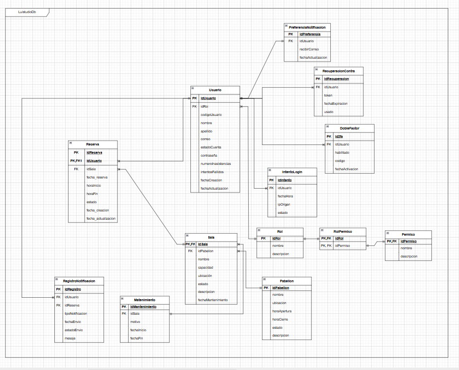

# Base de Datos – Luistudio

## Motor

**PostgreSQL** hospedado en Supabase / Neon, accedido vía **Prisma ORM** desde el backend NestJS en el puerto `5432`.



## Entidades principales

### Módulo: Usuarios y Acceso

| Entidad               | Descripción |
|-----------------------|-------------|
| `Usuario`             | Datos del usuario (estudiante o administrador): nombre, apellido, código, correo institucional, contraseña (hash bcrypt), estado (habilitado / deshabilitado). |
| `Rol`                 | Define el tipo de usuario: Administrador o Estudiante. |
| `Permiso`             | Permisos granulares asociados a cada rol. |
| `IntentoLogin`        | Registro de intentos de inicio de sesión fallidos para bloqueo automático. |
| `DobleFactor`         | Configuración de autenticación de dos factores (2FA) por usuario. |
| `RecuperacionContra`  | Tokens temporales para el flujo de restablecimiento de contraseña. |

### Módulo: Reservas y Salas

| Entidad      | Descripción |
|--------------|-------------|
| `Sala`       | Información de la sala: nombre, capacidad, ubicación, estado (disponible / en mantenimiento). |
| `Pabellón`   | Agrupación de salas por edificio o ubicación física dentro del campus. |
| `Reserva`    | Registro de reservas: sala, usuario, fecha, hora inicio, hora fin, estado (activa / cancelada). |
| `Mantenimiento` | Periodos de mantenimiento programados para una sala, que bloquean su disponibilidad. |

### Módulo: Notificaciones

| Entidad                   | Descripción |
|---------------------------|-------------|
| `RegistroNotificacion`    | Historial de todas las notificaciones enviadas (tipo, destinatario, fecha, contenido). |
| `PreferenciaNotificacion` | Configuración personal de qué notificaciones desea recibir cada usuario. |
| `email_outbox`            | Cola de correos pendientes de envío (confirmaciones, recordatorios, alertas). |

### Módulo: Auditoría

| Entidad      | Descripción |
|--------------|-------------|
| `audit_log`  | Registro de acciones relevantes en el sistema: actor, acción, entidad afectada, fecha. Usado principalmente en modificaciones de reservas y cambios de seguridad. |

## Relaciones clave

```
Usuario ──< Reserva >── Sala
Usuario ──< IntentoLogin
Usuario ── DobleFactor
Usuario ── RecuperacionContra
Usuario ── PreferenciaNotificacion
Usuario ──< RegistroNotificacion
Sala ── Pabellón
Sala ──< Mantenimiento
Rol ──< Permiso
Usuario >── Rol
```

## Índices recomendados

- `Sala.ubicacion` → para filtros rápidos por campus/pabellón.
- `Reserva.usuario_id + Reserva.fecha` → para validar límite de reservas simultáneas.
- `IntentoLogin.usuario_id + IntentoLogin.fecha` → para detección de accesos fallidos.
- `audit_log.entidad + audit_log.entidad_id` → para trazabilidad por recurso.
