# Arquitectura inicial y dise?o estructural - Luistudio

Este documento reune el contenido base para redactar las secciones 5 y 6 del informe del proyecto Luistudio. Esta escrito c?mo insumo academico: puede copiarse al informe final y ajustarse seg?n el formato requerido por el curso.

## 5. Arquitectura inicial y dise?o del software

Luistudio se disena c?mo una aplicacion web cliente-servidor para gestionar reservas de salas de estudio. La solucion separa la interfaz de usuario, la l?gica de negocio, la seguridad, la persistencia y los servicios externos con el objetivo de mantener el sistema mantenible, testeable y extensible.

La arquitectura inicial se compone de los siguientes bloques:

| Bloque | Tecnologia | Responsabilidad principal |
| --- | --- | --- |
| Cliente web | React, TypeScript, Tailwind CSS, Vite | Presentar la interfaz, gestionar estado de sesi?n y consumir la API REST. |
| API backend | Java 21, Spring Boot 3 | Exponer endpoints, validar permisos, ejecutar reglas de negocio y coordinar persistencia. |
| Seguridad | Spring Security, JWT, bcrypt, 2FA | Autenticar usuarios, proteger rutas, emitir tokens y controlar acceso por rol. |
| Persistencia | Spring Data JPA, Hibernate, PostgreSQL | Guardar usuarios, salas, reservas, horarios, preferencias, auditor?a y correos pendientes. |
| Notificaciones | Email outbox, Gmail API, Resend API o log fallback | Encolar y enviar correos de recuperaci?n, 2FA, confirmaciones y recordatorios. |
| Despliegue | Vercel, Render, Supabase | Publicar frontend, backend y base de datos administrada. |

### Objetivos arquitectonicos

- Separar responsabilidades para evitar clases con demasiadas razones de cambio.
- Centralizar reglas de reserva en el backend para proteger la integridad del negocio.
- Evitar acoplamiento directo con proveedores externos mediante abstracciones.
- Facilitar cambios futuros en reglas, proveedores de correo, vistas del frontend y configuraciones por campus.
- Proteger informaci?n sensible mediante autenticaci?n JWT, control por rol y hash de contrasenas.
- Mantener una API REST estable para que el frontend no dependa de detalles internos de persistencia.

## 5.1 Vista l?gica de la arquitectura

La vista l?gica muestra los modulos principales del sistema y sus dependencias conceptuales. Luistudio aplica una arquitectura por capas en backend y una organizacion por responsabilidades en frontend.

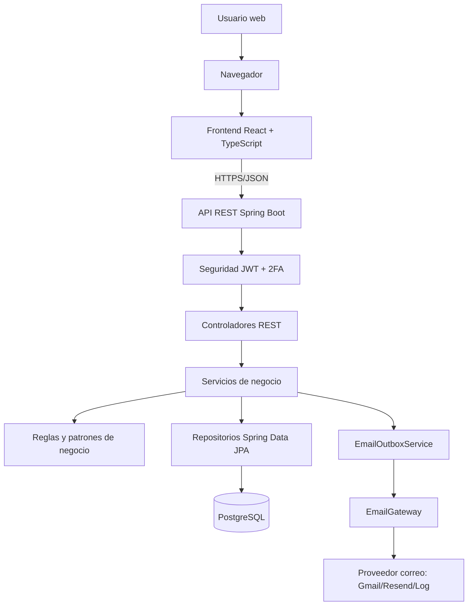

### Vista l?gica por capas del backend

### Vista l?gica del frontend

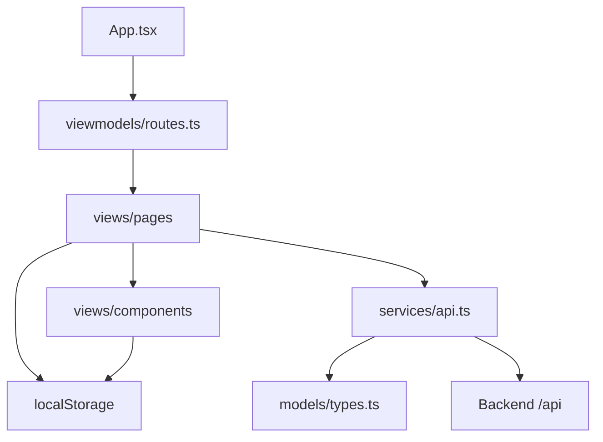

### Modulos funcionales principales

| M?dulo | Componentes principales | Descripcion |
| --- | --- | --- |
| Autenticaci?n y seguridad | `AuthController`, `AuthService`, `JwtService`, `JwtAuthenticationFilter`, `LoginStrategy` | Login, JWT, 2FA, recuperaci?n de contrase?a y bloqueo por intentos fallidos. |
| Reservas | `BookingController`, `BookingService`, `BookingValidationService`, `ReservationRepository` | Creacion, edici?n, cancelaci?n, consulta e integracion calendario `.ics`. |
| Salas y disponibilidad | `RoomController`, `RoomService`, `RoomScheduleService`, `RoomRepository` | CRUD de salas, disponibilidad, horarios por campus/sala y mantenimientos. |
| Administracion | `AdminController`, `UserService`, `SystemConfigService` | Gestion de usuarios, configuraci?n de l?mites y horarios generales. |
| Preferencias | `PreferenceController`, `PreferenceService` | Preferencias de correo, recordatorios, tema visual, escala de fuente y vista inicial. |
| Notificaciones | `EmailOutboxService`, `EmailGatewayResolver`, `EmailGateway` | Cola transaccional de correos y env?o mediante adaptadores. |
| Auditoria | `AuditService`, `AuditLogRepository` | Registro de acciones relevantes, c?mo actualizaciones de reservas. |

## 5.3 Explicacion y justificacion del dise?o

### Separacion cliente-servidor

La aplicacion usa un frontend React separado de un backend Spring Boot. Esta decision permite que la interfaz evolucione de forma independiente del negocio y que las reglas criticas queden protegidas en el servidor. El navegador solo solicita operaciones por API REST; no decide si una reserva es v?lida, si un usuario es administrador o si una sala est? disponible.

### Backend por capas

El backend se organiza en controladores, servicios, repositorios, modelos, DTOs, seguridad y excepciones. Esta separacion cumple SRP porque cada capa tiene una razon de cambio distinta:

| Capa | Justificacion |
| --- | --- |
| Controller | Traduce peticiones HTTP a llamadas de aplicacion y devuelve respuestas JSON. |
| Service | Contiene reglas de negocio y coordina casos de uso. |
| Repository | Encapsula acceso a base de datos mediante Spring Data JPA. |
| Model | Representa entidades persistentes del dominio. |
| DTO | Define contratos externos sin exponer entidades JPA directamente. |
| Security | Aisla autenticaci?n, autorizacion y manejo de JWT. |
| Exception | Centraliza respuestas de error con `GlobalExceptionHandler`. |

Esta estructura reduce acoplamiento, simplifica pruebas unitarias y permite cambiar detalles de persistencia o presentaci?n sin reescribir reglas centrales.

### API REST y DTOs

La comunicaci?n entre frontend y backend se realiza con JSON sobre HTTP. Los DTOs (`BookingResponse`, `RoomResponse`, `LoginResponse`, etc.) actuan c?mo contratos publicos y evitan que el cliente dependa de atributos internos de las entidades JPA. Esto protege el modelo de dominio y permite ajustar tablas o relaciones sin romper necesariamente la interfaz externa.

### Validacion centralizada de reservas

La creaci?n y edici?n de reservas se v?lida en `BookingService` mediante una lista de objetos `BookingValidationService`. Cada regla revisa una condicion concreta: capacidad, duraci?n m?xima, horario permitido, disponibilidad de sala, cantidad m?xima de reservas activas y consistencia entre hora inicial/final. Esta decision aplica OCP: para agregar una nueva restriccion se crea una nueva regla sin modificar el flujo principal.

### Seguridad por JWT, roles y 2FA

El sistema usa tokens JWT para autenticar solicitudes posteriores al login. `JwtAuthenticationFilter` interpreta el token y coloca la identidad del usuario en el contexto de seguridad. `AccessGuard` concentra verificaciones c?mo usuario autenticado o administrador, lo que evita repetir l?gica de permisos en cada controlador.

La autenticaci?n en dos pasos se modela c?mo una estrategia de login. Si el usuario no tiene 2FA, recibe un token final. Si tiene 2FA, recibe un token provisional y debe confirmar un c?digo enviado por correo. Este dise?o permite extender el flujo de autenticaci?n sin saturar `AuthService` con condicionales complejos.

### Persistencia con JPA y repositorios

Las entidades JPA modelan los conceptos principales: usuario, rol, sala, reserva, horario, mantenimiento, preferencias, c?digos 2FA, reseteo de contrase?a, auditor?a y correos en cola. Los repositorios Spring Data JPA encapsulan consultas y operaciones CRUD. Esta elecci?n reduce c?digo repetitivo y mantiene las consultas cerca del agregado que representan.

### Outbox para notificaciones

El sistema no envia correos directamente dentro del caso de uso principal. Primero registra una fila en `email_outbox` y luego `EmailOutboxService` procesa los pendientes con un scheduler. Esto mejora resiliencia: si el proveedor de correo falla, la reserva ya puede quedar registrada y el correo se reintenta. Tambien evita que una falla externa bloquee completamente la operacion del usuario.

### Adaptadores para proveedores externos

El env?o de correo depende de la interfaz `EmailGateway`. Las implementaciones concretas (`GmailEmailAdapter`, `ResendEmailAdapter`, `LogEmailGateway`) adaptan proveedores distintos al mismo contrato interno. Esta decision evita que el dominio dependa de APIs externas y facilita cambiar proveedor por variables de entorno.

### Frontend organizado por responsabilidades

El frontend separa modelos, servicios API, viewmodels, p?ginas y componentes. `services/api.ts` centraliza endpoints, token JWT y manejo de errores HTTP. Las p?ginas se concentran en interacci?n y presentaci?n. Los componentes reutilizables, c?mo modales y layouts, evitan duplicaci?n visual.

### Justificacion global

La arquitectura elegida es adecuada para Luistudio porque el sistema necesita seguridad, reglas de disponibilidad, administraci?n, notificaciones y crecimiento funcional. Una arquitectura por capas con patrones puntuales mantiene el proyecto entendible para un equipo universitario y suficientemente robusto para evolucionar sin reescrituras grandes.

## 5.4 Patron de dise?o aplicado

El detalle operativo de patrones est? documentado en `docs/principios/application.md`. En est? seccion se resume su aplicacion para el informe.

| Patron | Tipo | Ubicacion | Problema que resuelve |
| --- | --- | --- | --- |
| Controller-Service-Repository | Arquitectonico / Spring | `controller`, `service`, `repository` | Separa entrada HTTP, negocio y persistencia. |
| DTO Mapper | Estructural de soporte | `DtoMapper` | Evita exponer entidades JPA al frontend y centraliza conversiones. |
| Strategy | Comportamiento | `service/auth/strategy/*` | Permite intercambiar o agregar reglas/algoritmos sin modificar servicios principales. |
| Facade | Creacional | `metodos privados y service/auth/*`, `EmailGatewayResolver` | Centraliza creaci?n de entidades y seleccion de gateway. |
| Adapter | Estructural | `service/email/gateway/*Gateway` | Encapsula diferencias entre Gmail, Resend y log. |
| Command | Comportamiento | `service/booking/command/*` | Encapsula tareas programadas de recordatorio c?mo comandos ejecutables. |
| Repository | Persistencia | `repository/*Repository` | Abstrae operaciones de base de datos. |
| Global Exception Handler | Manejo transversal | `GlobalExceptionHandler` | Normaliza errores de negocio y validaci?n para la API. |

### Patron principal destacado: Servicio de validaci?n de reservas

`BookingService` no implementa todas las validaciones con una cadena larga de `if`. En su lugar recibe una lista de `BookingValidationService` por inyeccion de dependencias. El servicio concentra m?todos privados para cada condicion de validaci?n.

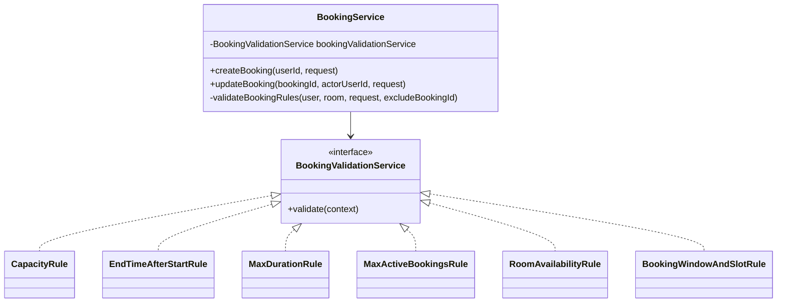

La ventaja es que una nueva regla, por ejemplo bloqueo por feriados o prioridad por tipo de usuario, puede agregarse c?mo otra clase que implemente `BookingValidationService` sin reescribir `BookingService`.

## 6. Diseno estructural

El dise?o estructural describe las clases, relaciones y colaboraciones estaticas principales. En Luistudio existen dos estructuras relevantes: el modelo de dominio persistente y la estructura de servicios/controladores que ejecutan los casos de uso.

## 6.1 Diagrama de clases de dise?o

### Diagrama general de dominio

### Diagrama de servicios, controladores y repositorios

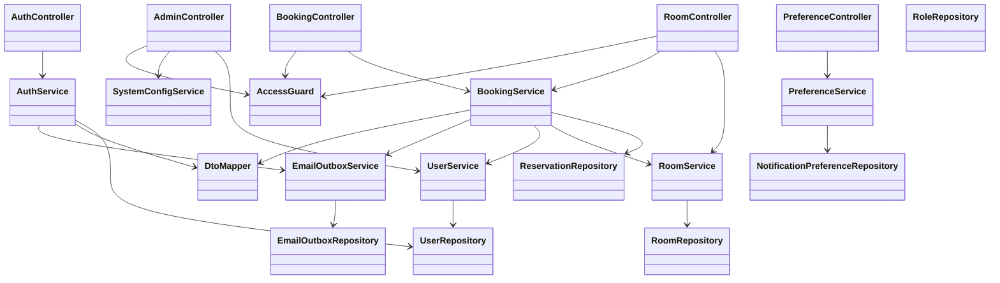

### Diagrama de patrones aplicados

## 6.2 Descripcion de clases

### Clases de presentaci?n HTTP

| Clase | Responsabilidad | Colaboradores |
| --- | --- | --- |
| `AuthController` | Expone endpoints de login, 2FA, usuario actual y recuperaci?n de contrase?a. | `AuthService`, `CurrentUserProvider`. |
| `BookingController` | Expone endpoints para crear, editar, cancelar, listar reservas y descargar `.ics`. | `BookingService`, `AccessGuard`. |
| `RoomController` | Expone consulta de salas, disponibilidad, CRUD de salas y mantenimientos. | `RoomService`, `BookingService`, `AccessGuard`. |
| `AdminController` | Expone endpoints administrativos de usuarios, configuraci?n, horarios y mapa de campus. | `UserService`, `SystemConfigService`, `RoomScheduleService`, `CampusMapService`. |
| `PreferenceController` | Gestiona preferencias del usuario autenticado. | `PreferenceService`, `AccessGuard`. |
| `UserLookupController` | Permite buscar usuarios por c?digo para agregarlos c?mo participantes. | `UserService`, `AccessGuard`. |

### Clases de servicios de aplicacion

| Clase | Responsabilidad | Decisiones importantes |
| --- | --- | --- |
| `AuthService` | Gestiona login, 2FA, bloqueo por intentos fallidos y recuperaci?n de contrase?a. | Usa `LoginStrategy`, `SecurityCodeService`, `JwtService` y `EmailOutboxService`. |
| `BookingService` | Ejecuta casos de uso de reservas. | Valida reglas con `BookingValidationService`, reutiliza reservas duplicadas logicas, genera `.ics` y encola correos. |
| `RoomService` | Gestiona salas, disponibilidad y mantenimientos. | Coordina catalogo, horarios, capacidad y estados de sala. |
| `RoomScheduleService` | Administra horarios por campus y sala. | Permite validar bloques y detectar conflictos con reservas futuras. |
| `UserService` | Lista usuarios, cambia estados y obtiene usuarios por id/c?digo. | Mantiene reglas de perfiles y permisos administrativos. |
| `PreferenceService` | Lee y actualiza preferencias del usuario. | Sincroniza tema, escala de fuente, notificaciones y vista inicial. |
| `SystemConfigService` | Maneja par?metros globales y por campus. | Valida cambios de duraci?n de bloque seg?n reservas futuras. |
| `EmailOutboxService` | Encola y procesa correos pendientes. | Aplica outbox, reintentos y fallback de gateway. |
| `AuditService` | Registra acciones relevantes. | Apoya trazabilidad de operaciones administrativas o sensibles. |
| `AccessGuard` | Centraliza validaci?n de usuario autenticado y rol admin. | Evita duplicar verificaciones de permisos. |
| `DtoMapper` | Convierte entidades a DTOs de respuesta. | Reduce duplicaci?n y protege el modelo persistente. |

### Clases de dominio

| Clase | Descripcion |
| --- | --- |
| `UserEntity` | Representa usuarios del sistema, sus credenciales, estado, rol y 2FA. |
| `RoleEntity` | Representa roles c?mo administrador y estudiante. |
| `RoomEntity` | Representa salas o recursos reservables con capacidad, ubicacion, campus, pabellon y estado. |
| `ReservationEntity` | Representa una reserva con usuario, sala, fecha, hora, estado, cantidad de personas y observacion. |
| `RoomScheduleEntity` | Define horarios especificos por sala. |
| `CampusScheduleEntity` | Define horarios y duraci?n de bloque por campus. |
| `MaintenanceEntity` | Representa indisponibilidades o mantenimientos programados de una sala. |
| `NotificationPreferenceEntity` | Guarda preferencias de notificaci?n y accesibilidad visual por usuario. |
| `EmailOutboxEntity` | Representa un correo pendiente, enviado o fallido dentro de la cola transaccional. |
| `AuditLogEntity` | Guarda eventos de auditor?a para trazabilidad. |
| `TwoFactorCodeEntity` | Guarda c?digos temporales de autenticaci?n en dos pasos. |
| `PasswordResetEntity` | Guarda tokens temporales de recuperaci?n de contrase?a. |
| `LoginAttemptEntity` | Registra intentos de login para bloqueo temporal y seguridad. |

### Interfaces y clases de patrones

| Clase o interfaz | Patron | Funcion |
| --- | --- | --- |
| `BookingValidationService` | Strategy | Contrato com?n para reglas de validaci?n de reservas. |
| `CapacityRule` | Strategy | Verifica m?nimo/m?ximo de personas y capacidad. |
| `EndTimeAfterStartRule` | Strategy | Verifica que la hora final sea posterior a la inicial. |
| `MaxDurationRule` | Strategy | Limita duraci?n seg?n configuraci?n del campus. |
| `MaxActiveBookingsRule` | Strategy | Limita cantidad de reservas activas por usuario. |
| `RoomAvailabilityRule` | Strategy | Evita choques con reservas existentes o indisponibilidades. |
| `BookingWindowAndSlotRule` | Strategy | Valida ventana permitida y alineacion con bloques horarios. |
| `LoginStrategy` | Strategy | Define respuesta de login seg?n configuraci?n del usuario. |
| `StandardLoginStrategy` | Strategy | Emite JWT final para login sin 2FA. |
| `TwoFactorLoginStrategy` | Strategy | Emite token provisional y envia c?digo 2FA. |
| `BookingService.buildActiveReservation` | Facade | Crea reservas activas con valores iniciales consistentes. |
| `RoomService.buildAvailableRoom` | Facade | Crea entidades de sala a partir de solicitudes. |
| `RoomService.buildScheduledMaintenance` | Facade | Crea mantenimientos o indisponibilidades. |
| `SecurityCodeService` | Facade | Crea c?digos 2FA, tokens de reseteo e intentos de login. |
| `EmailGateway` | Adapter | Interfaz com?n para proveedores de correo. |
| `GmailEmailAdapter` | Adapter | Adapta Gmail API al contrato interno. |
| `ResendEmailAdapter` | Adapter | Adapta Resend API al contrato interno. |
| `LogEmailGateway` | Adapter | Implementa fallback local por logs. |
| `EmailGatewayResolver` | Facade | Selecciona gateway seg?n variables de entorno disponibles. |
| `BookingReminderStrategy` | Strategy | Contrato para acciones programadas de recordatorio. |
| `BookingReminderScheduler` | Strategy invoker | Ejecuta comandos de recordatorio mediante scheduler. |

### Clases/archivos relevantes del frontend

| Archivo | Responsabilidad |
| --- | --- |
| `src/App.tsx` | Composicion general de la aplicacion y navegacion principal. |
| `src/viewmodels/routes.ts` | Define rutas y metadatos de navegacion por rol. |
| `src/services/api.ts` | Centraliza llamadas HTTP, base URL, JWT, manejo de errores y contratos API. |
| `src/models/types.ts` | Tipos compartidos de dominio y presentaci?n. |
| `src/views/pages/LoginPage.tsx` | Flujo de login y recuperaci?n. |
| `src/views/pages/ReservasPage.tsx` | Creacion de reservas y seleccion de horarios/salas. |
| `src/views/pages/MisReservasPage.tsx` | Consulta, edici?n y cancelaci?n de reservas propias. |
| `src/views/pages/SalasPage.tsx` | Administracion de salas. |
| `src/views/pages/AdminReservasPage.tsx` | Revision administrativa de reservas. |
| `src/views/pages/PerfilesPage.tsx` | Gestion administrativa de usuarios. |
| `src/views/components/modals/*` | Modales reutilizables de confirmaci?n, edici?n, 2FA y mensajes. |

## 6.3 Modelo din?mico

El modelo din?mico describe c?mo cambian los objetos y c?mo colaboran durante los casos de uso. En Luistudio los flujos m?s importantes son autenticaci?n, reserva, cancelaci?n, administraci?n y env?o de notificaciones.

### 6.3.1 Estados principales

#### Ciclo de vida de una reserva

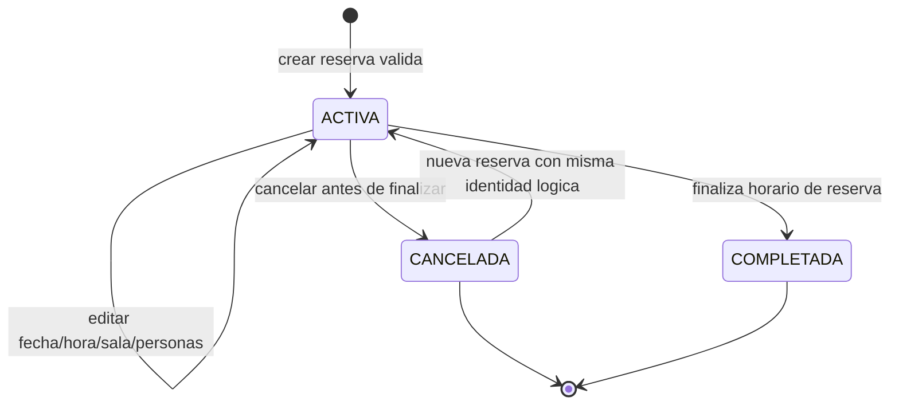

Notas:

- Una reserva nace c?mo `ACTIVA` si supera todas las reglas de negocio.
- La cancelaci?n solo se permite si la reserva aun no finalizo.
- Si el usuario intenta reservar el mismo recurso, fecha y horario, se reutiliza el registro existente y se actualiza su informaci?n.
- `COMPLETADA` representa el estado esperado para reservas que ya concluyeron seg?n la fecha/hora.

#### Ciclo de vida de autenticaci?n con 2FA

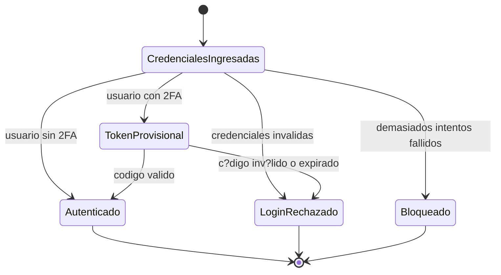

#### Ciclo de vida de correo en outbox

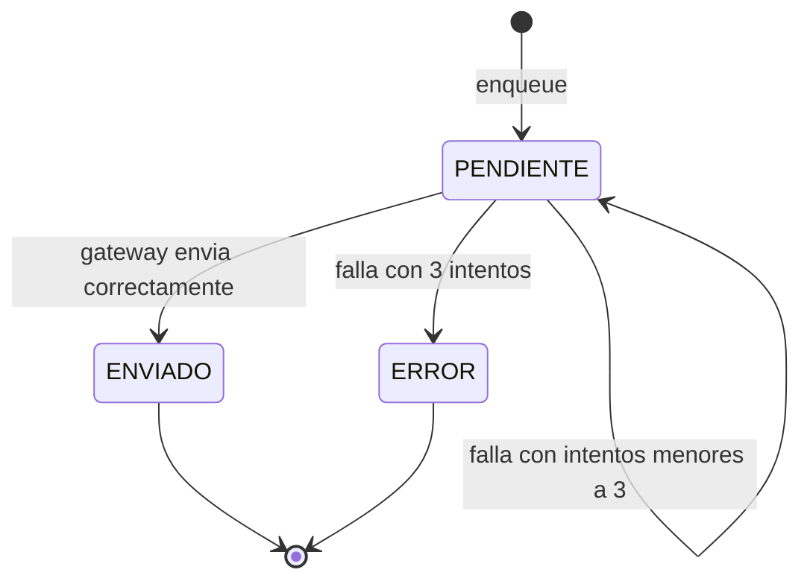

## 6.3.2 Diagramas de secuencia

### Secuencia 1: Login estandar sin 2FA

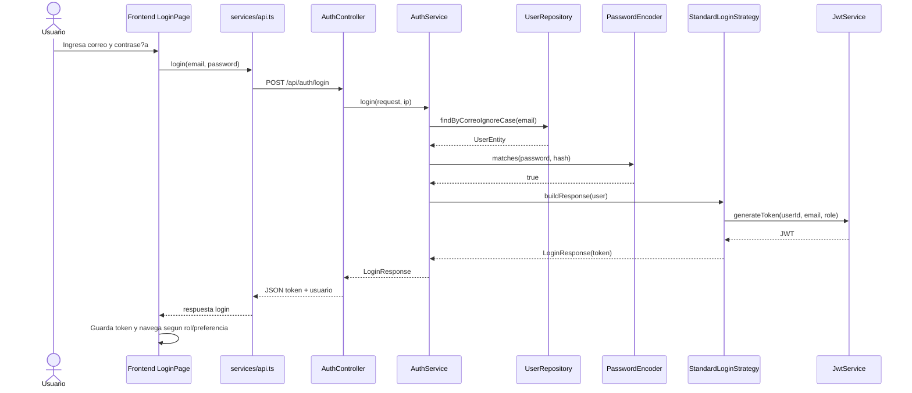

### Secuencia 2: Login con 2FA

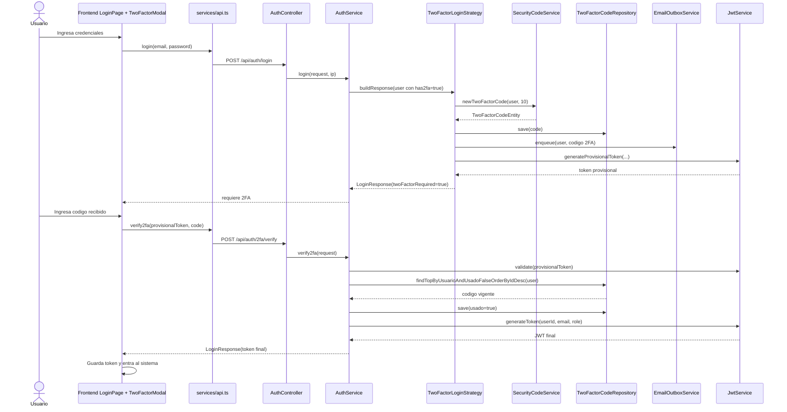

### Secuencia 3: Crear reserva

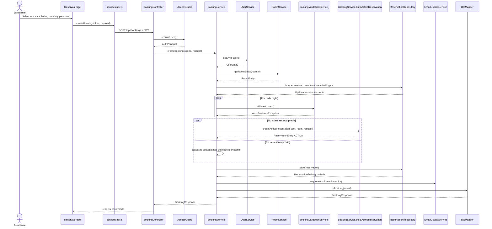

### Secuencia 4: Cancelar reserva

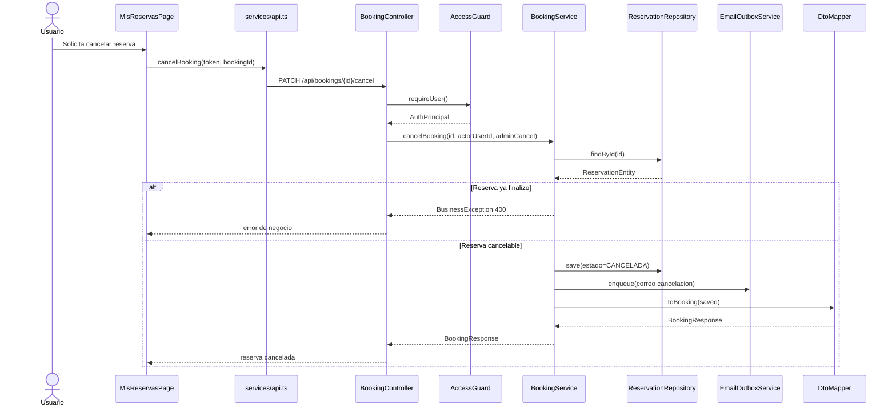

### Secuencia 5: Administrador actualiza una sala

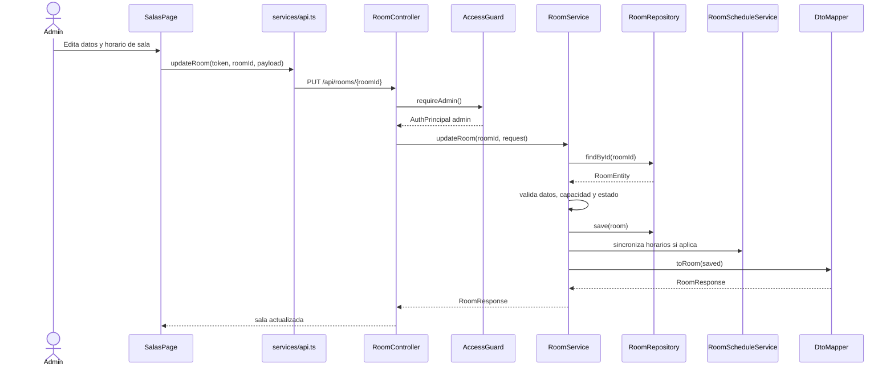

### Secuencia 6: Procesamiento asincrono de correos

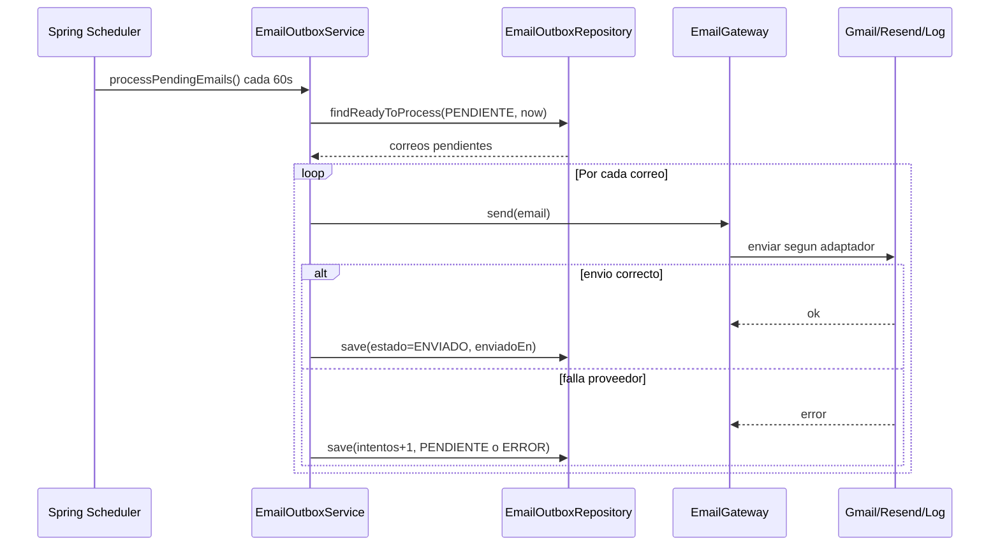

## Notas para redaccion final

- En el informe final se puede usar `5.2` para vista fisica/de despliegue si el formato lo exige, aunque no fue solicitado en este documento.
- Si el docente pide UML formal, los diagramas Mermaid pueden convertirse a imagen o replicarse en StarUML, Visual Paradigm, draw.io o PlantUML.
- Para no sobrecargar el diagrama de clases, se recomienda mostrar solo entidades y servicios principales, dejando DTOs y repositorios secundarios en tablas descriptivas.
- La seccion de patrones debe referenciar `docs/principios/application.md` c?mo documento tecnico interno del equipo.
